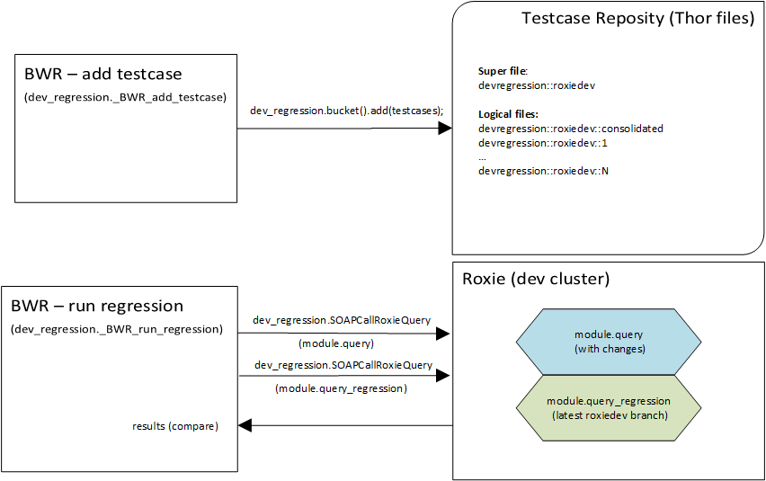

# RoxieDev Regression Testing
Last update on: 06.03.2020
## Introduction
- This module defines an ECL-based framework to allow developers to run regression testing for any given roxie query.

## Overview

  

- The framework operates on the assumption that two different versions of the same query have been deployed on the same dev roxie cluster.
- Query (A) should be deployed off a local working dev branch.
- Query (B) should be deployed off the latest dev (RoxieDev) branch.
- Any existing testcases can (and should) be used by developers to validate their changes.
- New testcases can be added at any point by any developer.

## Coding Guidelines
The framework expects all input and output layouts to be clearly defined for each service. As a general rule, the following attributes are expected to be defined under a <b>devtest</b> sub-folder.
* service_folder.<b>devtest</b>._service_name.layout
* service_folder.<b>devtest</b>._service_name.BWR_add_testcases
* service_folder.<b>devtest</b>._service_name.BWR_run_regression

For reference, see <b>doxie.devtest</b> sub-folder.

