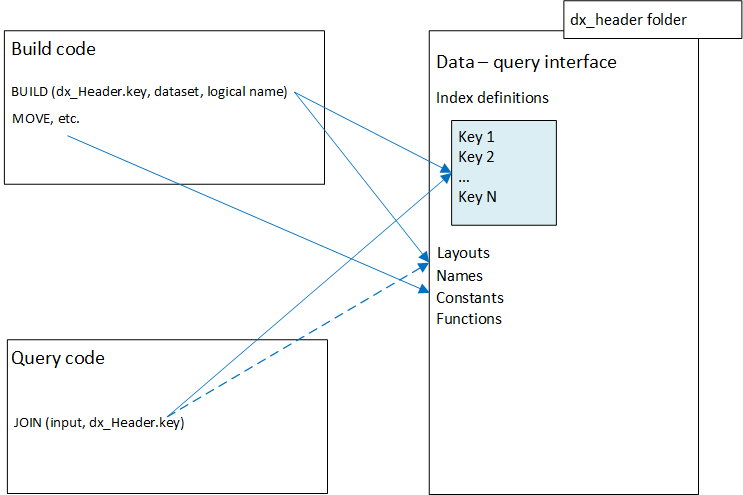

# Data Transfer (dx) Modules
Last update on: 03.04.2019
## Introduction

- We never had a clear separation between build and query code in our ECL repository. References to common `INDEX` definitions have always been placed on both sides, without much regard for attribute dependencies and related implications and side-effects.
- As a result, it is not unusual for issues related to ECL build code to come up during `Roxie Release` migration. Fixes usually involve chasing down developers and pulling one or more attributes to the migration list. In addition, without this separation, ECL build code ends up referenced and pulled in when syntax-checking the queries, adding to overall compile time and increasing query footprint.
- Removing this dependency has always been a goal, as it should minimize (if not eliminate) these commons issues, stream lining the `Roxie Release` process and query deployment.    

## Overview
<div>
<p align="center">
  
</p>
</div>

- The dx modules are designed to be the interface between Thor and Roxie, and are not expected to match build code folder name. 
- Changes to dx modules must be reviewed by a Roxie developer and should be pushed to Git as separate commits (not involving build code). The commit is cherry-picked from Thorprod to Roxiedev. 
- We are not proposing a one-size fits all solution here. Below we include some general guidelines to formalize and facilitate the process. The goal is to give developers some flexibility while being mindful of the issues we are trying to avoid.
 

## Coding Guidelines
- Module names must start with dx_ prefix followed by a descriptive name applicable to each group of keys. E.g. `dx_email`, `dx_best`, `dx_header`.
-	<b>Attributes defined in dx modules must <u>not</u> reference data build code. The point is to isolate all index definitions from any data build dependencies</b>. 
-	Common functionality and constants expected to be used by both data build and query should be defined within this module. This may include, for example, common constants used for autokeys, if applicable to the dataset.
-	Preferably, index <b>field names</b> should all be lower case with underscore word separators. E.g.: first_name, best_ssn, etc.
-	All key attribute names must start with key prefix. 
-	Preferably, all key attributes must use explicit layout definitions. For clarity, this does not preclude use of inherited layouts but implicit references to base files must be avoided.
- All key attributes must `EXPORT` a single index. The only exception are key definitions applicable to multiple data environments (e.g. FCRA/non-FCRA). 
- Key attributes used in multiple data environments (e.g. FCRA/non-FCRA) must support a parameter<sup>[1](#fn1)</sup>  to allow queries to reference the correct underlying data.
- References to super file names in key attributes should be easily readable. Avoid convoluted `MACROS` that require drilling down to multiple attributes to identify a file name.
- References to super file names in key attributes should start with the same prefix for all file names. In additional, all file names should include data location prefix (`Data_Services.Data_location`).
- Preferably, define all index layouts in a single `Layouts` attribute within the same dx module .
- Preferably, define all constants in a single `Constants` attribute within the same dx module.
- Preferably, define all functions in a single `Functions` attribute within the same dx module.
- All code in dx module must follow proper indentation/formatting (preferably, no tabs -- two spaces wherever tabs might be used). The IDE can be configured to use spaces instead of tabs.
- Although we have a few sets of common coding style across the repository    , we should be consistent at least within the same module. For example, function names like `is_glb_ok()` should not be mixed with `isGLBOk()`.
- Imports: Use IMPORT `$` to reference attributes in the current module/folder. The use of a non-prefixed attributes can be confusing and difficult to debug. When importing other modules, try and avoid “IMPORT AS” since again, this leads to more custom style of tracing through code.

<a name="fn1">[1]</a> Data_Services.data_env defines NonFCRA, FCRA and PRCT.

## Example

---
`dx_InquiryHistory.Layouts:`
```
EXPORT Layouts := MODULE

  EXPORT Inquiry := RECORD
      STRING30  lex_id;
      STRING30  product_id;
      STRING8   inquiry_date;
      STRING20  transaction_id;
      STRING22  date_added;
      STRING5   customer_number;
      STRING9   customer_account;
      STRING9   ssn;
  END; 

END;
```
---
`dx_InquiryHistory.Key_LexID:`
```
IMPORT $, Data_Services;

lRec := $.Layouts.Inquiry;

EXPORT Key_LexID(UNSIGNED1 data_env = …) 
    := INDEX({lRec.appended_did}, lRec, 
        data_services.Data_location.Prefix ('InquiryHistory') + … +'::lexid';

```